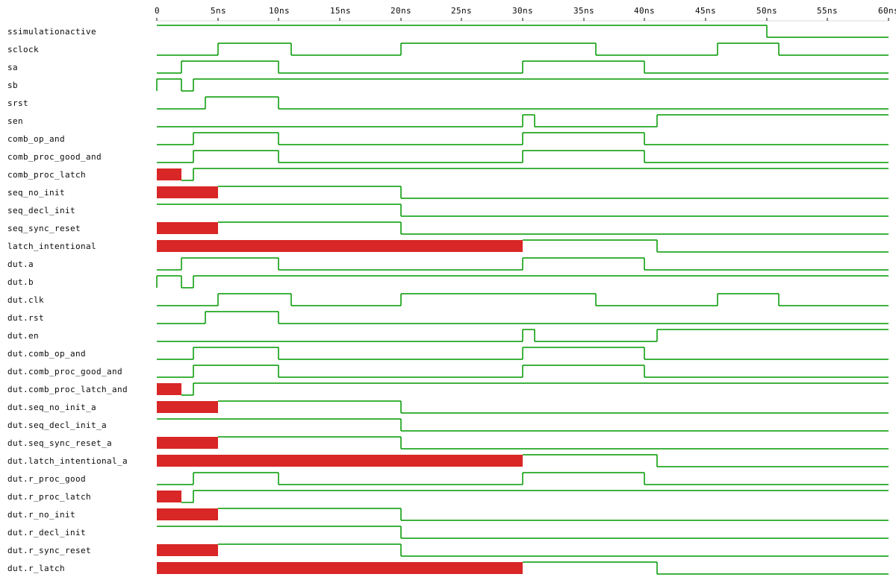

# logic_styles

A tutorial of the **coding styles** a synthesizer infers logic from.
Sibling project to [`basics/glossary`](../glossary), which is the
gallery of bare gate primitives. This project sits one layer above
those: how the same input/output table can be written different ways
in HDL, what each style maps to in the netlist, and which ones are
*traps* you should learn to recognise.

Three families of inferred logic:

* **Combinational** — pure function of inputs, no memory; gates / LUTs.
* **Sequential** — remembers state across clock edges; flip-flops.
* **Latch** — transparent while an enable is high, holds when low;
  level-sensitive cell. In modern FPGA design, almost always a bug.

And, inside the sequential family, three register-init strategies:

* **No init, no reset** — undefined power-up; not portable.
* **Declaration init** (`signal r : std_logic := '1';`) — Cyclone IV
  bakes this into the FF's bitstream power-up value; not portable
  beyond.
* **Explicit synchronous reset** — portable, re-armable at runtime.

## Synthesised netlist

The diagram (`build/logic_styles.svg`, regenerated by `make
diagram`) shows: gates for the combinational good cases, a
`$dlatch` cell for **both** the trap (`comb_proc_latch_and`) and
the intentional latch (`latch_intentional_a`) — same shape, same
semantics, different reasons for being there — and a `$dff` for
each of the three register variants, with the `SR` pin appearing
on `seq_sync_reset_a`.

## What the testbench shows

`tb_logic_styles` runs five phases:

1. **Init observation** at t = 1 ns (before the first clock edge).
   The three sequential outputs are captured and asserted to be
   `'U'`, `'1'`, `'U'` respectively — the heart of the init lesson.
   The latch trap output (`comb_proc_latch_and`) is also `'U'` here
   because the incomplete process never assigned it. This visible
   `'U'`-leak in simulation is the runtime symptom of the latch bug.
2. **Combinational sweep** of all four `(a, b)` combinations: the two
   *good* combinational variants must agree with each other and the
   reference.
3. **Clock with reset asserted**: `seq_sync_reset` becomes `'1'`; the
   other two registers follow `a`.
4. **Release reset**: all three registers follow `a`.
5. **Latch hold demo**: drive the intentional latch through
   transparent → hold → transparent and verify the held value
   survives unrelated `a` toggles.

In the waveform, look for: `seq_decl_init` defined from the very
start (red `'1'` line at t = 0), `seq_no_init` and `seq_sync_reset`
showing `'X'` until their first defining edge, the partial-process
latch trap (`comb_proc_latch`) lagging behind `comb_proc_good_and`,
and `latch_intentional` flat-lining whenever `en` is low.

## On the board

`top_logic_styles_board` is the Quartus synthesis top. The 50 MHz
clock is divided down to ~1.5 Hz before being fed into the `clk`
input of `logic_styles` — at the raw 50 MHz a registered signal
visually looks like a wire (1 cycle = 20 ns of delay) and you'd see
nothing. With a slow clock the sample-and-hold becomes obvious to
the eye.

| LED  | Output                       | What you'll see                                                                  |
| ---- | ---------------------------- | -------------------------------------------------------------------------------- |
| LED0 | `comb_op_and` (correct)      | `a AND b` — instant.                                                             |
| LED1 | `comb_proc_latch_and` (BUG)  | when `a = 1` follows `b`; when `a = 0` HOLDS the last `b`.                       |
| LED2 | `seq_sync_reset_a`           | samples `a` once per slow edge (~1.5 Hz). `button3` clears it on the next edge. |
| LED3 | `latch_intentional_a`        | while `button2` held → follows `button1`; release `button2` → freezes.           |

Buttons are active-low on this board (`button1` = PIN_88, `button2`
= PIN_89, `button3` = PIN_90); the design re-inverts so the rest of
the code reads "pressed = 1".

### Two on-board demos to try

**Demo 1 — see the latch bug as a stuck LED:**
hold both buttons (LED0 and LED1 both light up). Release `button1`
only. LED0 turns off instantly (combinational AND collapses to 0).
**LED1 stays lit** — the latch trap stored the last `b = 1` because
`a` is now `0` and the partial process didn't assign the output.
That stuck LED is the bug, made visible.

**Demo 2 — sequential vs. latch vs. combinational latency:**
press and release `button1` quickly. LED0 (combinational) tracks
your presses precisely. LED2 (registered, slow clock) samples on
the next slow edge — a brief press in between samples is *missed*.
LED3 follows `button1` only while `button2` is held; releasing
`button2` **freezes** LED3 at whatever `button1` was at that
instant.

## Cyclone IV portability note

On Cyclone IV the bitstream sets every flip-flop's power-up state.
That means in **simulation** a register declared without `:= '0'`
shows `'U'` until the first edge (correct), but on **hardware** the
same register comes up at `'0'` because the bitstream loaded that
value. Hardware happens to behave better than the simulator here —
hiding the bug. Don't rely on this. The testbench's phase 1
observations exist precisely to surface what the hardware would
silently fix.

For portable code (across FPGA families, and between FPGA and ASIC),
prefer the **explicit synchronous reset** style (`seq_sync_reset_a`)
for any signal whose start-up value matters.
