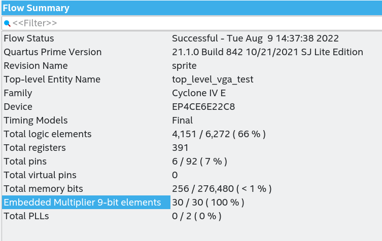
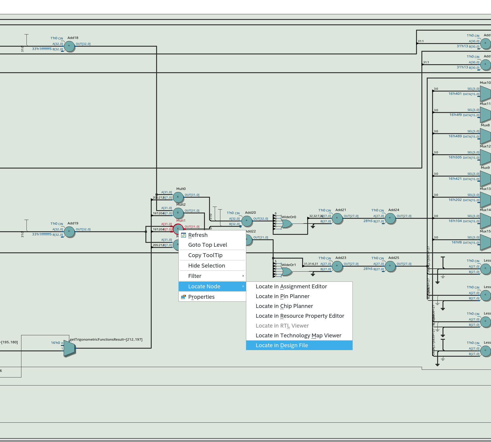
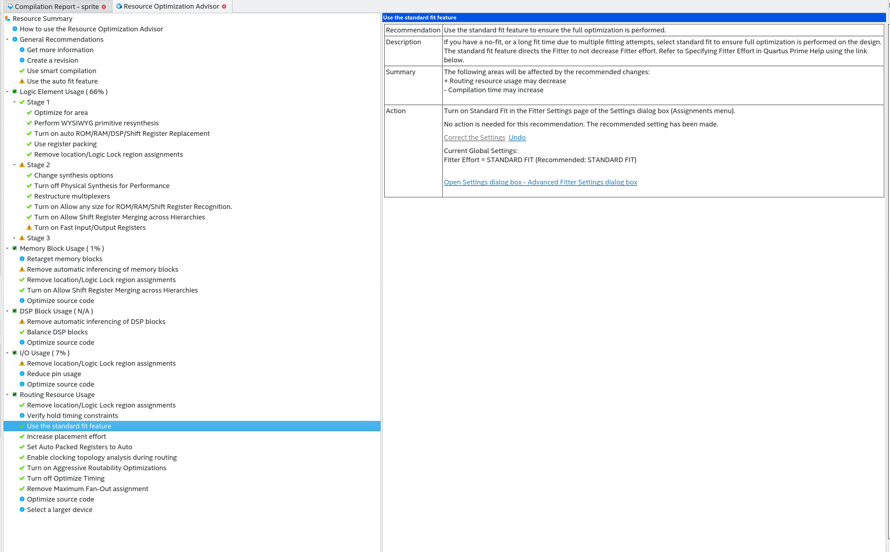
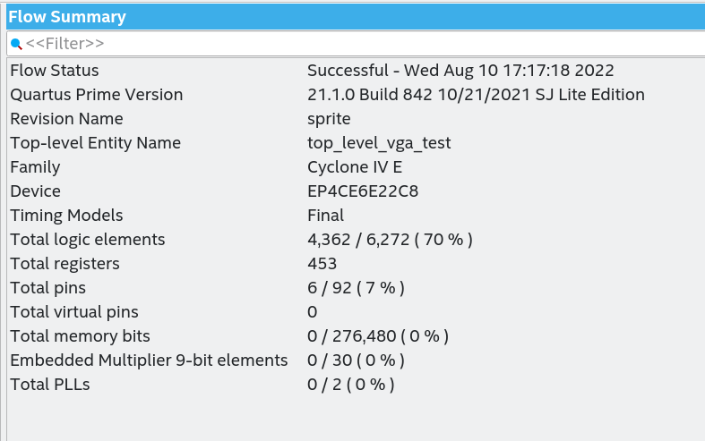

# vga_sprites
VGA sprite demo: multiple sprites driven by a trigonometric sin/cos LUT
for rotation, with optional gravity physics.

## WIP
Two sprites are currently consuming all multipliers, as seen in the quartus summary:


So I search in the RTL diagram where those multipliers where, and search for the design file:




And of course, it pointed out the multipliers in the rotate function:

```
     function rotate(sprite_size : Size2D;
                     position    : Pos2D;
                     rotation    : AngleType := ( others => '0' )) return Pos2D is
        constant trigResults     : TrigonometricFunctionsResultsRecord := getTrigonometricFunctionsResult(rotation);
        variable newPos : Pos2D;
     begin
       -- reinterpret  as sfixed
        newPos.x :=   (position.x * to_integer(signed(to_slv(trigResults.cos)))
                    - (position.y * to_integer(signed(to_slv(trigResults.sin))))) / 64;
        newPos.y :=   ((position.x * to_integer(signed(to_slv(trigResults.sin))))
                    + (position.y * to_integer(signed(to_slv(trigResults.cos))))) / 64;
        return newPos;
     end function;

```

Then I tried to use the automatic optimizations with the optimization advisor:



But the result is the same.

So I found the [Embedded multipliers in Cyclone IV Devices](https://www.intel.com/programmable/technical-pdfs/654776.pdf), which says:
```
In addition to the embedded multipliers in Cyclone IV devices, you can implement
soft multipliers by using the M9K memory blocks as look-up tables (LUTs). The LUTs
contain partial results from the multiplication of input data with coefficients that
implement variable depth and width high-performance soft multipliers for low-cost,
high-volume DSP applications. The availability of soft multipliers increases the
number of available multipliers in the device.
```
and links two other documents:
 * [Memory Blocks in Cyclone IV Devices](http://www.altera.com/literature/hb/cyclone-iv/cyiv-51003.pdf)
 * [Implementing Multipliers in FPGA Devices](http://www.altera.com/literature/an/an306.pdf)

So I will need to learn on how to do the LUT implementation to avoid using all multipliers, since I have a lot of available memory to use.
More information: 
 * http://www.andraka.com/multipli.php
 * https://www.microchip.com/content/dam/mchp/documents/FPGA/pld-design-resources/Implementing%20a%20Single-coefficient%20Multiplier.pdf

Using LUTs for multiplication tables for the sin and cos at the specific angles:



* No 9-bit multipliers used.
* 70% logic elements. To optimize. (note that now I am using 3 sprites instead of 2. Before was not even possible)

Thisall_multipliers_used is how the demo looks now:


## Rotation pipeline

For every pixel a sprite has to answer "is this pixel part of me?". That
means rotating the cursor position back into the sprite's own grid:
four LUT multiplies and two sums. Originally the `rotate` function did
all of it, together with the bounding-box test and the content lookup,
between two clock edges.

[`sprite_rotator.{vhd,v}`](sprite_rotator.vhd) splits the rotation over
two registers — the four products, then the two sums — and `sprite`
instantiates it:

| Clock edge | What gets registered |
| --- | --- |
| 1 | `sprite_rotator`: the four products `cos·x`, `sin·y`, `sin·x`, `cos·y` of the centre-relative cursor position |
| 2 | `sprite_rotator`: the rotated position |
| 3 | `sprite`: the content lookup, `outShouldDraw` |

So `outShouldDraw` now lags `inCursorPos` by three clocks instead of
one. All sprites lag equally and stay aligned with each other;
[`top_level_vga_test.{vhd,v}`](top_level_vga_test.vhd) shows them the
cursor two pixels ahead so the picture stays where it was.
`tb_vga_sprites_top` checks exactly that from the `rgb` / sync pins of
the board top: the big smiley's top row must start at the same pixel as
it did before the rotation was pipelined.

`rotate` is still in the package: it is the reference the testbenches
compare the pipeline against.

What this buys is a shorter longest path, and a rotation block that can
be tested on its own. Each sprite still owns a rotator; the rotator
takes centre-relative positions and knows nothing about sprite size or
screen position, so the next step — one rotator shared by several
sprites — needs an arbiter around it, not a different rotator.

### How much it helps

Estimated with yosys: the Verilog `sprite` with its default parameters,
flattened and mapped to generic 4-input LUTs. That is a rough stand-in
for Cyclone IV logic elements, not a Quartus result.

| | Single step | Pipelined |
| --- | :-: | :-: |
| LUTs | 1831 | 1424 |
| Flip-flops | 270 | 302 |
| Longest path, in LUT levels | 54 | 46 |

```bash
yosys -p "read_verilog -sv -I. sprite_rotator.v sprite.v; \
          synth -top sprite -flatten; abc -lut 4; opt_clean; stat; ltp -noff"
```

The rotator's own longest stage is 11 levels. What is left is the step
in front of it: the bounding-box test, and the subtract and divide by
`SCALE` on 32-bit integers, which still share a clock with the first
rotator stage. Giving that step a register of its own was tried and
only brings the path down to 42 levels, so the next thing to try for
speed is narrowing those integers, not adding stages.

Not done: a Quartus build. The logic-element count, Fmax and the
picture on the board are still to be checked there.

## TODO :
* optimize code
  * [x] try implementing my own multiplier with LUT
  * [x] pipeline the rotation (`sprite_rotator`)
  * share one rotator between sprites
  * improve rotation (better resolution, fix something?)
* [x] remove hardcoded values on boundaries for bouncing. Use sprites constants instead
* integrate input buttons with debouncers
* [x] use vectors for sprites velocities. Instantiate several sprites.
* [x] animate sprites — sprites rotate (`rotateSprite` process), bounce off the
  screen edges, and optionally fall under gravity (`tb_sprite_gravity` covers
  the fall-and-bounce path).
* [x] add testbench — `test/` now has seven:
  * `tb_trigonometric`       — algebraic property checks on the rotate() function and LUT.
  * `tb_multiply_by_sin_lut` — unit tests for the multiplyBySinLUT primitive.
  * `tb_sprite_rotator`      — the pipelined rotator against rotate(), for all 32
    rotation steps and every position of an 11x11 sprite, including the two-clock lag.
  * `tb_sprite_raster`       — scans a whole small screen past a rotated "F" and compares
    every pixel, three clocks later, with a one-step reference: picture and latency.
  * `tb_sprite_gravity`      — sprite entity with gravity on, fall/bounce cause-effect.
  * `tb_vga_sprites_top`     — the board top (`top_level_vga_test`) for 4.5 ms: line length,
    and the exact pixels where the big smiley's top row appears on one scan line.
  * `tb_sprite`              — basic sprite-entity smoke test (not CI-wired).
* [x] mirror the design + the six CI-wired testbenches in Verilog. Source files:
  `sprite.v`, `sprite_rotator.v`, `top_level_vga_test.v`, `trigonometric_functions.vh`,
  `test/tb_*.v`. Wired through `V_TOP` / `V_TB_TOPS` / `V_SRC_FILES` / `V_TB_FILES` /
  `V_INCDIRS` in the Makefile.
