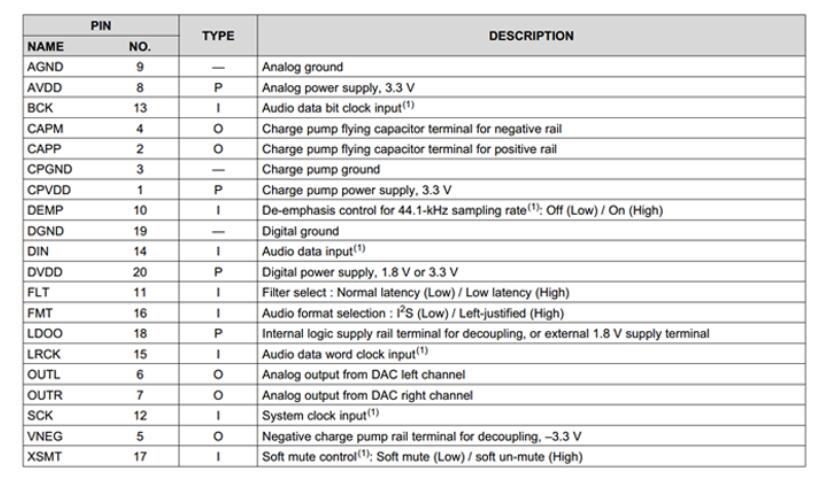

# Attempt to generate a sinusoid through a PCM5102 I2S DAC board.
## Board
Item on ali-express, with information on pinout and diagram: https://es.aliexpress.com/item/32968353841.html

## DAC information
 * Datasheet: https://www.ti.com/lit/ds/symlink/pcm5102.pdf
### Extracts
#### Pinout

#### Clock frequencies

## Code
Code copied from from https://github.com/newdigate/papilio_duo_i2s.git

