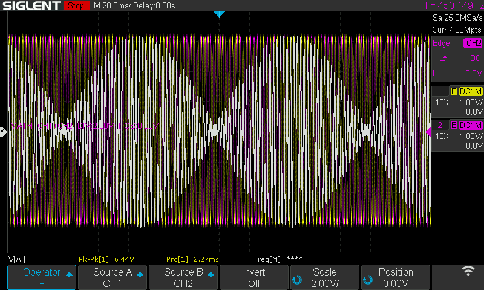
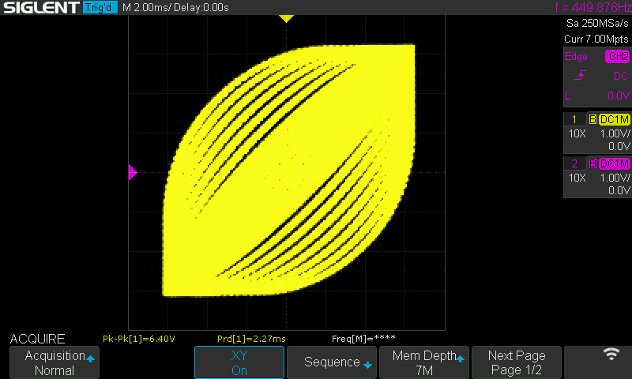

Code copied from https://github.com/newdigate/papilio_duo_i2s/tree/master/i2s_function_generator_stereo

## Testing beats
440 + 450 Hz signals in channel 1 and 2. The white is the sum of the two.

View on X-Y

