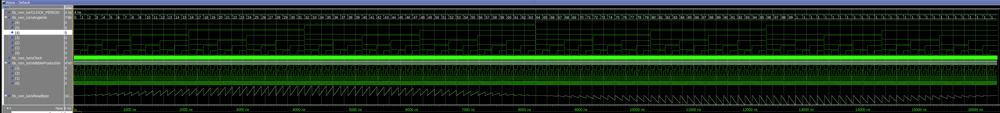

Testing how to force using a ROM (from file) for a LUT.

I did a LUT for the game tests for the trigonometric multiplications, to avoid using all 9-bit multipliers. But I ended using all the logic cells. So I wanted to force using memory cells, which needs to be syncronic.

This is an implementation of a sine table in LUT (128 values with only 32 stored samples), including multiplication tables up to 16 per each LUT position, used for multiplying and add numbers bigger than one nibble.

BRAM used as ROM for 32 multiplications tables with numbers 1 to 16, between 0 and PI/2.

User inputs a factor, which will be multiplied by the sin of an angle (0<= angle <=128=2PI) using the LUT multiplication tables and adding them with the proper shift on the MSB.

*  Testing the sine table (16 multiplication values -0 to F-) on a 128 sin table. So sin(0 to 127) * (0 to F)

