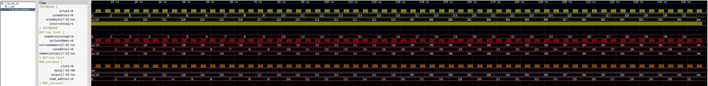

Testing how to force using a ROM (from file) for a LUT.

I did a LUT for the game tests for the trigonometric multiplications, to avoid using all 9-bit multipliers. But I ended using all the logic cells. So I wanted to force using memory cells, which needs to be syncronic.

This example creates a memory block as ROM. The content is read from a hex-text file.

## Simulation
This is the testbench testing a single array of 32 values from ROM.

## Logic diagram
This is the diagram of the entity which instantiates the memory block

